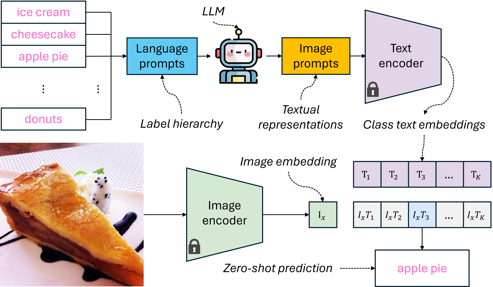

<h1 style="text-align: center;"> Making Better Mistakes in CLIP-Based Zero-Shot Classification with Hierarchy-Aware Language Prompts</h1>


[paper arXiv link](https://arxiv.org/abs/2503.02248)

## The proposed CLIP-based zero-shot classification process
Our approach queries an LLM to generate descriptions of the classes in the downstream tasks based on the associated label hierarchies of the downstream tasks for the subsequent CLIP-based zero-shot classification.
<div align="center">

</div>

## Installation
Our code requires **python=3.10** and **Ubuntu 20.04.6 LTS** (gemini APIs requires python>=3.10 to function properly). 
```commandline
pip install -r requirements.txt
```

## Setup configuration file: data_paths.yml

You need to replace **"/path/to/code"** in data_paths.yml with your current working directory where main.py of this code repo resides.

Change the **openai-key**, **anthropic-key**, and **google-key** in data_paths.yml to point to your text files storing the api-keys for OpenAI, Anthropic, and Google AI Studio.

Change the **dataset-home-dir*** in data_paths.yml to a directory that will be used to store the downloaded original datasets.

Change the **food-101**, **ucf-101**, **cub-200**, **sun-324**, and **imagenet** in data_paths.yml to point to directories that will store the val/test partitions of datasets employed in our experiments.

## Datasets
go to custom_datasets and run the associated dataset preparation scripts. Some datasets need manual download of the original datasets to the configured **dataset-home-dir** first as specified below. The original datasets occupies ~138 GB of storage, our processed val/test partitions takes ~27 GB of storage space.
```commandline
cd ./custom_datasets

# food-101
python food101.py

# ucf-101, need manual download of the original dataset, detailed instructions in ucf101.py
python ucf101.py

# cub-200
python cub200.py

# sun-324
python sun324.py

# imagenet-1k, need manual download of the original dataset, detailed instructions in imagenet.py
python imagenet.py
```

## Label hierarchies
The label hierarchy (tree) of each dataset and the associated hierarchical distance files are stored at:
```commandline
./trees
```
The associated pretty print of tree structures are stored at:
```commandline
./tree_viz
```
The text file containing pretty print of label hierarchy requires proper zoom out to show the structure correctly. 

## Query LLM to generate image prompts
Once configuration file is set with valid api keys and datasets are prepared, run the following bash script. This may take +20 hours depending on your request rate limits with the associated APIs.
**Note:** To avoid overwriting the image prompts we provided in ./image_prompts, you need to change the existing ./image_prompts folder to a different name.

```commandline
# generate CuPL image prompts, querying gpt-3.5-turbo
bash bash_LLM_query_cupl.sh

# generate VCD image prompts, querying gpt-3.5-turbo
bash bash_LLM_query_vcd.sh

# generate HIE (HieC and HieT) image prompts, querying gpt-3.5-turbo
bash bash_LLM_query_hie.sh 

# generate the proposed image prompts, this involves querying gpt-3.5-turbo, claude-3.5-sonnet, gemini-1.5-flash
bash bash_LLM_query_ours.sh
```

## CLIP (image-text contrastive loss) v.s. ViT (cross-entropy loss) error structure comparison
To generate the prediction results of CLIP and ViTs provided by PyTorch, you need to donwload the validation set of ImageNet and the associated development toolkit first (please see pretrained_vit.py comments for more information). The validation set of ImageNet is purely used to acquire the classname to numeric label map of PyTorch ViT models. To generate the prediction results of ViTs, run:

```commandline
bash bash_vits_inference.sh
```
To generate the histogram visualization of mistake severities, run the jupyter notebook: ./notebooks/CLIP_vs_ViTs_severity.ipynb

## Finetuning score offset hyper-parameter for HIE method on validation set
To find the proper score offset parameter employed by HIE method in our comparison, run:
```commandline
bash bash_hie_finetune.sh
```

## Zero-shot classification 
To produce the evaluation results in our main comparison, run:
```commandline
bash bash_comp_results.sh
```

## Ablation study
To produce the ablation study results, run:
```commandline
bash bash_ablation.sh
```

## Ensemble methods
To produce the comparison results of two different ensemble methods, run:
```commandline
bash bash_ensemble_method.sh
```

## Transferability of language prompts
To produce the classification results of image prompts acuqired from different language models, run:
```commandline
bash bash_lang_prompts_transfer.sh
``` 

## Acknowledgement
This codebase is partially refactored from the following GitHub repositories:
- [CLIP](https://github.com/openai/CLIP)
- [CuPL](https://github.com/sarahpratt/CuPL)
- [CRM-Better-Mistakes](https://github.com/sgk98/CRM-Better-Mistakes)
- [classify_by_description_release](https://github.com/sachit-menon/classify_by_description_release)
- [ChatGPT-Powered-Hierarchical-Comparisons-for-Image-Classification](https://github.com/Zhiyuan-R/ChatGPT-Powered-Hierarchical-Comparisons-for-Image-Classification)